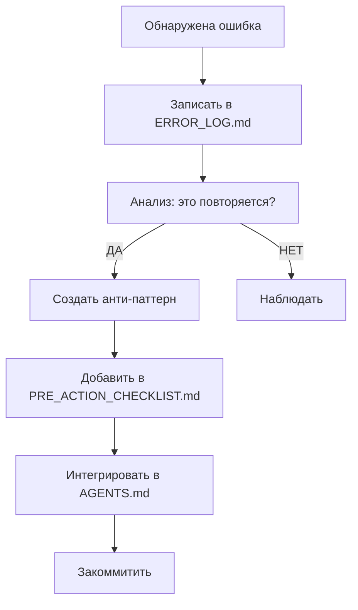

# 🚫 ANTI-PATTERNS — Чего НЕ делать (Никогда!)

**Версия:** 1.0  
**Дата создания:** 2 марта 2026 г.  
**Статус:** ✅ Активно  
**Приоритет:** 🔴 Критично (обязательно к прочтению)

---

## 🎯 НАЗНАЧЕНИЕ

Этот файл содержит **запрещённые паттерны** — действия, которые **НИКОГДА** нельзя совершать.

Каждый анти-паттерн основан на **реальной ошибке**, которая привела к:
- Потере данных
- Потере времени (4-5 дней)
- Сбоям сессии
- Деградации проекта

**Правило:** Если действие описано здесь → **НЕ ДЕЛАТЬ**, даже если кажется правильным.

---

## 🔴 КРИТИЧЕСКИЕ АНТИ-ПАТТЕРНЫ (КАТЕГОРИЯ A)

### A-001: ❌ НЕ начинать изменения без бэкапа

**Почему:** Потеря 58 файлов, 4-5 дней работы

**Что НЕ делать:**
```powershell
# ❌ ПЛОХО: Начало изменений без бэкапа
rm -rf _TEMP/
# Создание новых файлов
# Изменение структуры
```

**Что делать:**
```powershell
# ✅ ХОРОШО: Сначала бэкап
git status
git add .
git commit -m "Backup: Перед изменениями"
.\scripts\auto-archive.ps1 -Reason "Before changes"
# Теперь можно работать
```

**Связанное правило:** [`PRE_ACTION_CHECKLIST.md`](./PRE_ACTION_CHECKLIST.md) — Пункт 1

---

### A-002: ❌ НЕ создавать файлы напрямую в Base/

**Почему:** Нарушение 3-уровневого процесса, битые ссылки, непроверенные изменения

**Что НЕ делать:**
```
❌ Base/NEW_RULE.md (напрямую)
```

**Что делать:**
```
✅ _drafts/NEW_RULE.md → _TEST_ENV/ → Base/
```

**Процесс:**
1. Создать в `_drafts/`
2. Протестировать в `_TEST_ENV/`
3. Проверить ссылки
4. Получить подтверждение
5. Переместить в `Base/`

**Связанное правило:** [`.qwen/QWEN.md`](./.qwen/QWEN.md) — раздел "3-уровневый процесс"

---

### A-003: ❌ НЕ удалять файлы без проверки

**Почему:** Потеря важных данных, нарушение ссылок

**Что НЕ делать:**
```powershell
# ❌ ПЛОХО: Удаление без проверки
rm -rf _TEMP/
rm important_file.md
```

**Что делать:**
```powershell
# ✅ ХОРОШО: Проверка перед удалением
.\scripts\safe-delete.ps1 -Path "_TEMP/" -DryRun
# Просмотр отчёта
# Подтверждение
.\scripts\safe-delete.ps1 -Path "_TEMP/" -AutoConfirm
```

**Связанное правило:** [`03-Resources/PowerShell/safe-delete.ps1`](./03-Resources/PowerShell/safe-delete.ps1)

---

### A-004: ❌ НЕ игнорировать encoding (UTF-8 без BOM)

**Почему:** 5+ сессий провалено из-за проблем с русскими символами

**Что НЕ делать:**
```powershell
# ❌ ПЛОХО: Создание файла с BOM
[System.IO.File]::WriteAllText("file.ps1", $content)
```

**Что делать:**
```powershell
# ✅ ХОРОШО: UTF-8 без BOM
[System.IO.File]::WriteAllText("file.ps1", $content, [System.Text.UTF8Encoding]::new($false))
```

**Проверка:**
```powershell
.\scripts\check-encoding.ps1 -Path "file.ps1"
```

**Связанное правило:** [`PRE_ACTION_CHECKLIST.md`](./PRE_ACTION_CHECKLIST.md) — Пункт 10

---

### A-005: ❌ НЕ пропускать тестирование в _TEST_ENV/

**Почему:** Битые ссылки, неработающие скрипты, ошибки в продакшене

**Что НЕ делать:**
```
❌ Создано → Закоммичено → Забыто
```

**Что делать:**
```
✅ Создано → _TEST_ENV/ → test-all-changes.ps1 → 100% → Base/
```

**Минимальные тесты:**
- ✅ Структура файлов
- ✅ Ссылки (нет битых)
- ✅ Интеграция с другими файлами
- ✅ Комплексные тесты (25/25)

**Связанное правило:** [`.qwen/QWEN.md`](./.qwen/QWEN.md) — раздел "Чек-лист перед коммитом"

---

### A-006: ❌ НЕ нарушать иерархию (агенты → пользователь)

**Почему:** Конфликт ролей, непонимание, ошибки в приоритетах

**Что НЕ делать:**
```
❌ Агенты подчиняются пользователю
❌ ИИ спрашивает у пользователя о задачах агентов
```

**Правильная иерархия:**
```
Пользователь (Владелец) → ИИ (Senior / БОСС) → Агенты (Подчинённые)
```

**Связанное правило:** [`.qwen/QWEN.md`](./.qwen/QWEN.md) — раздел "Иерархия"

---

### A-007: ❌ НЕ начинать без прочтения QWEN.md

**Почему:** Непонимание правил, нарушение процессов, повторение ошибок

**Что НЕ делать:**
```
❌ Прочитать AI_START_HERE.md → Начать работу
```

**Что делать:**
```
✅ AI_START_HERE.md → .qwen/QWEN.md → Начать работу
```

**Минимум:**
1. `AI_START_HERE.md` (точка входа)
2. `.qwen/QWEN.md` (обязательно!)
3. `ТЕКУЩАЯ_ЗАДАЧА.md` (активная задача)

**Связанное правило:** [`AGENTS.md`](./AGENTS.md) — раздел "Обязательное чтение"

---

### A-008: ❌ НЕ игнорировать ошибки в логах

**Почему:** Накопление проблем, внезапные сбои

**Что НЕ делать:**
```
❌ Ошибка в консоли → Игнорировать → Продолжить
```

**Что делать:**
```
✅ Ошибка → Записать в ERROR_LOG.md → Анализ → Решение → Исправление
```

**Процесс:**
1. Получить лог: `.\scripts\unity-get-logs.ps1`
2. Анализ: `ERROR_LOG.md` + `03_PATTERNS/error_solutions.md`
3. Решение → Запись в журнал
4. Исправление → Проверка

**Связанное правило:** [`ERROR_LOG.md`](./ERROR_LOG.md)

---

### A-009: ❌ НЕ создавать дубликаты знаний

**Почему:** Путаница, устаревание, сложность поддержки

**Что НЕ делать:**
```
❌ Создать KNOWLEDGE_BASE/new.md
❌ При этом уже есть 02-Areas/Documentation/similar.md
```

**Что делать:**
```powershell
# ✅ Проверка на дубликаты
.\scripts\check-duplicates.ps1 -Query "тема"
# Если найден похожий → Дополнить существующий
# Если нет → Создать новый
```

**Связанное правило:** [`03-Resources/PowerShell/check-duplicates.ps1`](./03-Resources/PowerShell/check-duplicates.ps1)

---

### A-010: ❌ НЕ завершать сессию без SESSION_HANDOVER.md

**Почему:** Потеря контекста, бесшовное продолжение невозможно

**Что НЕ делать:**
```
❌ Закрыть терминал → Конец сессии
```

**Что делать:**
```
✅ Запустить .\scripts\end-session.ps1
✅ Создать reports/SESSION_HANDOVER.md
✅ Закоммитить
✅ Закрыть сессию
```

**Связанное правило:** [`reports/SESSION_HANDOVER.md`](./reports/SESSION_HANDOVER.md) — создаётся при завершении сессии

---

## 🟡 СЕРЬЁЗНЫЕ АНТИ-ПАТТЕРНЫ (КАТЕГОРИЯ B)

### B-001: ❌ НЕ использовать `echo` в PowerShell без кавычек

**Почему:** Проблемы с русскими символами, интерпретация специальных символов

---

### B-002: ❌ НЕ создавать файлы в корне проекта

**Почему:** Загрязнение корня, сложность навигации

**Правильно:**
- Документы → `KNOWLEDGE_BASE/` или `02-Areas/Documentation/`
- Скрипты → `03-Resources/PowerShell/`
- Отчёты → `reports/`

---

### B-003: ❌ НЕ писать код без комментариев (для сложной логики)

**Почему:** Сложность понимания, поддержки

**Исключение:** Простой, очевидный код

---

### B-004: ❌ НЕ игнорировать StyleCop / SonarLint предупреждения

**Почему:** Накопление технического долга

---

### B-005: ❌ НЕ коммитить без понятного сообщения

**Почему:** Невозможно найти нужный коммит, сложность отката

**Правильно:**
```
Type: Описание

Детали (если нужно)
```

Пример:
```
Add: Система работы над ошибками

- ERROR_LOG.md — журнал ошибок
- ANTI_PATTERNS.md — запрещённые паттерны
- PRE_ACTION_CHECKLIST.md — чек-лист
```

---

## 🟢 КОСМЕТИЧЕСКИЕ АНТИ-ПАТТЕРНЫ (КАТЕГОРИЯ C)

### C-001: ❌ НЕ использовать смешанные стили именования

**Почему:** Сложность чтения, поддержки

**Правильно:**
- Файлы: `snake_case.md`
- Классы C#: `PascalCase`
- Переменные C#: `camelCase`

---

### C-002: ❌ НЕ оставлять закомментированный код

**Почему:** Загрязнение, путаница

**Правильно:** Удалить или переместить в `_drafts/`

---

## 📊 ТАБЛИЦА НАРУШЕНИЙ И ПОСЛЕДСТВИЙ

| Анти-паттерн | Последствие | Частота | Критичность |
|--------------|-------------|---------|-------------|
| A-001: Нет бэкапа | Потеря 58 файлов, 4-5 дня | 1 раз | 🔴 |
| A-002: Напрямую в Base/ | Битые ссылки, ошибки | 3+ раза | 🔴 |
| A-003: Удаление без проверки | Потеря данных | 1 раз | 🔴 |
| A-004: Encoding | 5+ проваленных сессий | 5+ раз | 🔴 |
| A-005: Нет тестов | Ошибки в продакшене | 2+ раза | 🔴 |
| A-006: Нарушение иерархии | Конфликт ролей | 2+ раза | 🟡 |
| A-007: Нет чтения QWEN.md | Нарушение процессов | 1 раз | 🔴 |
| A-008: Игнор логов | Накопление проблем | 3+ раза | 🟡 |
| A-009: Дубликаты | Путаница | 2+ раза | 🟡 |
| A-010: Нет SESSION_HANDOVER | Потеря контекста | 1 раз | 🟡 |

---

## 🔄 ПРОЦЕСС ДОБАВЛЕНИЯ НОВОГО АНТИ-ПАТТЕРНА



---

## 🎯 ПРОВЕРКА НАРУШЕНИЙ (АВТОМАТИЧЕСКАЯ)

**Скрипт:** `.\scripts\check-anti-patterns.ps1`

**Проверяет:**
- ✅ Файлы в Base/ без тестирования
- ✅ Encoding файлов
- ✅ Дубликаты знаний
- ✅ Отсутствие бэкапа перед изменениями

**Запуск:**
```powershell
.\scripts\check-anti-patterns.ps1 -BeforeCommit
```

---

## 🔗 СВЯЗАННЫЕ ФАЙЛЫ

- [`ERROR_LOG.md`](./ERROR_LOG.md) — Журнал ошибок
- [`PRE_ACTION_CHECKLIST.md`](./PRE_ACTION_CHECKLIST.md) — Чек-лист перед действиями
- [`POST_MORTEM_TEMPLATE.md`](./POST_MORTEM_TEMPLATE.md) — Шаблон анализа
- [`AGENTS.md`](./AGENTS.md) — Точка входа
- [`.qwen/QWEN.md`](./.qwen/QWEN.md) — Главный конфиг

---

**Последнее обновление:** 2 марта 2026 г.  
**Следующий пересмотр:** 9 марта 2026 г. (еженедельно)

**Правило:** Если действие описано здесь как анти-паттерн → **НЕ ДЕЛАТЬ НИКОГДА!**

