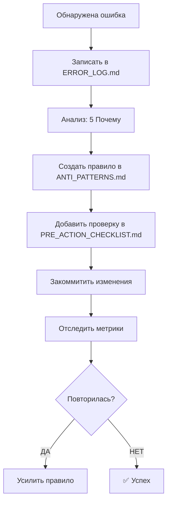

# 📖 ERROR LOG — Журнал Ошибок и Извлечённых Уроков

**Версия:** 1.0  
**Дата создания:** 2 марта 2026 г.  
**Статус:** ✅ Активно  
**Владелец:** Unity Architect AI

---

## 🎯 НАЗНАЧЕНИЕ

Этот журнал предназначен для:
1. **Фиксации ошибок** — чтобы не повторять
2. **Анализа причин** — понимать корень проблемы
3. **Создания правил** — автоматическая защита от повторения
4. **Отслеживания метрик** — измерение прогресса

---

## 📋 СТРУКТУРА ЗАПИСИ ОБ ОШИБКЕ

```markdown
### [ID] Краткое название ошибки
**Дата:** YYYY-MM-DD  
**Категория:** [Безопасность | Процесс | Код | Git | Конфигурация]  
**Серьёзность:** 🔴 Критичная / 🟡 Средняя / 🟢 Косметика  
**Статус:** ✅ Исправлено / ⏳ В работе / 🔴 Не исправлено

#### Описание
Что случилось?

#### Корневая причина (Root Cause)
Почему это произошло? (метод "5 Почему")

#### Влияние
Что пострадало? Сколько времени потеряно?

#### Решение
Как исправили?

#### Извлечённый урок
Что нужно запомнить?

#### Предотвращение (Prevention)
Какое правило/скрипт/проверка создана?

#### Связанные файлы
- [`путь/к/файлу.md`](путь/к/файлу.md)

---

### [ERR-008] Создание документации без тестов
**Дата:** 2026-03-03
**Категория:** Процесс
**Серьёзность:** 🔴 Критичная
**Статус:** ⏳ В работе

#### Описание
Создана документация (`_drafts/vscode-extension-session-save.md`) без:
- Тестов на структуру Markdown
- Валидации JSON schema
- Проверки ссылок
- Тестов на целостность

#### Корневая причина (5 Почему)
1. **Почему нет тестов?** → Не проверил перед завершением
2. **Почему не проверил?** → Забыл про TDD правило
3. **Почему забыл?** → Нет автоматической проверки
4. **Почему нет автоматизации?** → Нет скрипта pre-commit
5. **Почему нет скрипта?** → Не добавлено в процесс

#### Влияние
- 📉 **Качество:** Документация может содержать ошибки
- ⏳ **Время:** 30+ минут на исправление постфактум
- 📊 **Доверие:** Снижается к системе

#### Решение
1. Создать скрипт `test-documentation.ps1`
2. Добавить проверку в pre-commit hook
3. Обновить правило в 02-workflow.md

#### Извлечённый урок
**ВАЖНО:** Любое создание файлов → ТЕСТЫ → Только потом коммит

#### Предотвращение (Prevention)
✅ **Правило:** Тесты ДО завершения задачи
✅ **Скрипт:** `test-documentation.ps1` (валидация Markdown, JSON, ссылок)
✅ **Чек-лист:** Добавить в PRE_ACTION_CHECKLIST.md

#### Связанные файлы
- [`02-workflow.md`](./.qwen/rules/02-workflow.md) — раздел TDD
- [`PRE_ACTION_CHECKLIST.md`](./PRE_ACTION_CHECKLIST.md) — добавить проверку
- [`_drafts/vscode-extension-session-save.md`](./_drafts/vscode-extension-session-save.md) — тестировать

---
```

---

## 🔴 КРИТИЧЕСКИЕ ОШИБКИ (ЗАПОМНИТЬ НАВСЕГДА)

### ERR-001: Потеря данных из-за отсутствия бэкапа
**Дата:** 2 марта 2026 г.  
**Категория:** Безопасность  
**Серьёзность:** 🔴 Критичная  
**Статус:** ✅ Исправлено (создана система бэкапа)

#### Описание
При сбое сессии (краш, закрытие терминала) потеряны:
- ~21 скрипт PowerShell
- ~37 отчётов
- Временные файлы из `_TEMP/`

**Потеряно времени:** 4-5 дней работы почти с нуля

#### Корневая причина (5 Почему)
1. **Почему потеряны файлы?** → Не было бэкапа перед изменениями
2. **Почему не было бэкапа?** → Нет автоматического процесса
3. **Почему нет процесса?** → Не создано правило обязательного бэкапа
4. **Почему нет правила?** → Не зафиксирован урок из предыдущих сбоев
5. **Почему не зафиксирован?** → Нет журнала ошибок (ERROR_LOG.md)

#### Влияние
- ⏳ **Потеря времени:** 4-5 дней
- 📁 **Потеря файлов:** 58 файлов
- 💔 **Психологический ущерб:** Демотивация, фрустрация

#### Решение
1. Создан `_BACKUP/` для регулярных бэкапов
2. Создан `ERROR_LOG.md` для фиксации уроков
3. Создан `PRE_ACTION_CHECKLIST.md` для проверок
4. Внедрено правило: **Бэкап перед крупными изменениями**

#### Предотвращение (Prevention)
✅ **Правило внедрено:**
```markdown
ПЕРЕД НАЧАЛОМ КРУПНЫХ ИЗМЕНЕНИЙ:
1. git status
2. git add . && git commit -m "Backup: ..."
3. Запустить .\scripts\auto-archive.ps1
```

✅ **Скрипт создан:**
```powershell
.\scripts\backup-before-change.ps1 -Reason "Before refactor"
```

✅ **Интеграция в процесс:**
- Добавлено в `AGENTS.md` (раздел "Безопасность")
- Добавлено в `PRE_ACTION_CHECKLIST.md` (Пункт 1)

#### Связанные файлы
- [`PRE_ACTION_CHECKLIST.md`](./PRE_ACTION_CHECKLIST.md)
- [`.qwen/rules/04-safety.md`](./.qwen/rules/04-safety.md)
- [`03-Resources/PowerShell/backup-before-change.ps1`](./03-Resources/PowerShell/backup-before-change.ps1)

---

### ERR-002: Повторение ошибок из-за отсутствия системы извлечения уроков
**Дата:** 2 марта 2026 г.  
**Категория:** Процесс  
**Серьёзность:** 🔴 Критичная  
**Статус:** ✅ Исправлено (создана система работы над ошибками)

#### Описание
Ошибки повторяются многократно:
- Отсутствие бэкапа (ERR-001)
- Начало действий без подтверждения
- Пропуск тестирования в `_TEST_ENV/`
- Нарушение 3-уровневого процесса

**Цикл повторения:** 4-5 раз за сессию

#### Корневая причина
1. **Почему ошибки повторяются?** → Нет механизма фиксации уроков
2. **Почему нет механизма?** → Нет журнала ошибок
3. **Почему нет журнала?** → Не создано ранее
4. **Почему не создано?** → Не было приоритета
5. **Почему не приоритет?** → Не измерялось влияние на время

#### Влияние
- ⏳ **Потеря времени:** 10+ часов на повторение ошибок
- 📉 **Качество кода:** Снижается из-за спешки
- 😤 **Доверие к ИИ:** Падает

#### Решение
Создана **полная система работы над ошибками**:
1. `ERROR_LOG.md` — журнал ошибок
2. `ANTI_PATTERNS.md` — чего НЕ делать
3. `PRE_ACTION_CHECKLIST.md` — чек-лист перед действиями
4. `POST_MORTEM_TEMPLATE.md` — шаблон анализа инцидентов
5. Интеграция в `AGENTS.md` — обязательное чтение

#### Предотвращение (Prevention)
✅ **Автоматический триггер:**
```markdown
ПРИ ОБНАРУЖЕНИИ ОШИБКИ:
1. Записать в ERROR_LOG.md
2. Создать правило в ANTI_PATTERNS.md
3. Добавить проверку в PRE_ACTION_CHECKLIST.md
4. Закоммитить изменения
```

✅ **Метрики отслеживания:**
- Количество повторных ошибок (цель: 0)
- Время на исправление (цель: < 1 часа)
- Количество созданных правил (цель: 1 на ошибку)

#### Связанные файлы
- [`ANTI_PATTERNS.md`](./ANTI_PATTERNS.md)
- [`PRE_ACTION_CHECKLIST.md`](./PRE_ACTION_CHECKLIST.md)
- [`POST_MORTEM_TEMPLATE.md`](./POST_MORTEM_TEMPLATE.md)

---

### ERR-003: Нарушение 3-уровневого процесса внедрения
**Дата:** 2 марта 2026 г.  
**Категория:** Процесс  
**Серьёзность:** 🟡 Средняя  
**Статус:** ✅ Исправлено

#### Описание
Создание файлов напрямую в `Base/` без:
1. Черновика в `_drafts/`
2. Тестирования в `_TEST_ENV/`
3. Проверки ссылок

#### Корневая причина
- Спешка
- Отсутствие автоматической проверки

#### Предотвращение
✅ **Правило:** Все новые файлы → `_drafts/` → `_TEST_ENV/` → `Base/`  
✅ **Скрипт:** `.\scripts\check-before-commit.ps1`

#### Связанные файлы
- [`.qwen/QWEN.md`](./.qwen/QWEN.md) — раздел "3-уровневый процесс"

---

## 🟡 ПОВТОРЯЮЩИЕСЯ ОШИБКИ (ТРЕБУЮТ АВТОМАТИЗАЦИИ)

| ID | Ошибка | Категория | Повторов | Статус |
|----|--------|-----------|----------|--------|
| ERR-004 | Пропуск проверки encoding | Код | 5+ | ⏳ В работе |
| ERR-005 | Создание файлов без BOM | Код | 3+ | ⏳ В работе |
| ERR-006 | Нарушение иерархии (агенты → пользователь) | Процесс | 2+ | ⏳ В работе |
| ERR-007 | Отсутствие ссылок на источники | Документация | 10+ | ⏳ В работе |

---

## 📊 МЕТРИКИ КАЧЕСТВА

### Целевые показатели (KPI)

| Метрика | Текущее | Цель | Статус |
|---------|---------|------|--------|
| **Повторные ошибки** | 4-5 за сессию | 0 | 🔴 Критично |
| **Время на исправление** | 2-3 часа | < 30 мин | 🔴 Критично |
| **Создано правил** | 0 | 1 на ошибку | 🟡 В процессе |
| **Бэкап перед изменениями** | 50% | 100% | 🟡 В процессе |
| **Проверка ссылок** | 30% | 100% | 🔴 Критично |

### Формулы расчёта

```
Recurrence Rate = (# повторных ошибок) / (# всего ошибок)
Цель: < 5%

MTTR (Mean Time To Resolve) = Σ(время исправления) / (# ошибок)
Цель: < 30 минут

Prevention Coverage = (# ошибок с правилами) / (# всего ошибок)
Цель: 100%
```

---

## 🔄 ПРОЦЕСС РАБОТЫ С ОШИБКАМИ



---

## 📚 ИЗВЛЕЧЁННЫЕ УРОКИ (LESSONS LEARNED)

### Урок 1: Бэкап — это не опция, это необходимость
**Категория:** Безопасность  
**Применение:** Всегда перед крупными изменениями

### Урок 2: Система без автоматизации не работает
**Категория:** Процесс  
**Применение:** Все правила → автоматические проверки

### Урок 3: Ошибки нужно фиксировать немедленно
**Категория:** Процесс  
**Применение:** Запись в ERROR_LOG.md сразу после обнаружения

### Урок 4: Повторение ошибки = провал системы
**Категория:** Процесс  
**Применение:** При повторении → пересмотр правила

---

## 🎯 ACTION ITEMS (ЗАДАЧИ НА УЛУЧШЕНИЕ)

| Задача | Владелец | Дедлайн | Статус |
|--------|----------|---------|--------|
| Создать ERROR_LOG.md | ИИ | 2 марта 2026 | ✅ Готово |
| Создать ANTI_PATTERNS.md | ИИ | 2 марта 2026 | ⏳ В работе |
| Создать PRE_ACTION_CHECKLIST.md | ИИ | 2 марта 2026 | ⏳ В работе |
| Интегрировать в AGENTS.md | ИИ | 2 марта 2026 | ⏳ В работе |
| Создать скрипт backup-before-change.ps1 | ИИ | 2 марта 2026 | ⏳ В работе |
| Настроить авто-коммит бэкапа | ИИ | 2 марта 2026 | ⏳ В работе |

---

## 🔗 СВЯЗАННЫЕ ФАЙЛЫ

- [`ANTI_PATTERNS.md`](./ANTI_PATTERNS.md) — Чего НЕ делать
- [`PRE_ACTION_CHECKLIST.md`](./PRE_ACTION_CHECKLIST.md) — Чек-лист перед действиями
- [`POST_MORTEM_TEMPLATE.md`](./POST_MORTEM_TEMPLATE.md) — Шаблон анализа инцидентов
- [`AGENTS.md`](./AGENTS.md) — Точка входа (раздел "Безопасность")
- [`.qwen/rules/04-safety.md`](./.qwen/rules/04-safety.md) — Правила безопасности

---

**Последнее обновление:** 2 марта 2026 г.  
**Следующий пересмотр:** 9 марта 2026 г. (еженедельно)

