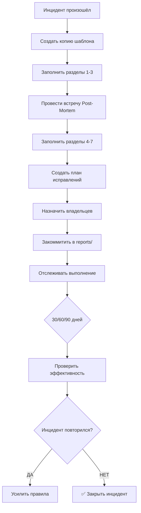

# 📋 POST-MORTEM TEMPLATE — Шаблон Анализа Инцидентов

**Версия:** 1.0  
**Дата создания:** 2 марта 2026 г.  
**Статус:** ✅ Активно  
**Назначение:** Анализ инцидентов и предотвращение повторения

---

## 🎯 НАЗНАЧЕНИЕ

Этот шаблон используется для **детального анализа инцидентов**:

- ✅ Потеря данных
- ✅ Сбой сессии
- ✅ Критические ошибки
- ✅ Повторяющиеся проблемы
- ✅ Потеря времени (>1 часа)

**Правило:** Серьёзный инцидент → Заполнить этот шаблон → Создать правила предотвращения

---

## 📝 ШАБЛОН POST-MORTEM

```markdown
# Post-Mortem: [Краткое название инцидента]

**ID:** INC-YYYY-NNN (например, INC-2026-001)  
**Дата инцидента:** YYYY-MM-DD HH:MM  
**Дата анализа:** YYYY-MM-DD  
**Владелец:** [Кто отвечает за исправление]  
**Статус:** ⏳ Открыт / ✅ Закрыт

---

## 1. КРАТКОЕ ОПИСАНИЕ (INCIDENT SUMMARY)

**Что случилось?** (2-3 предложения)

**Пример:**
> При сбое терминала во время очистки `_TEMP/` потеряны 21 скрипт PowerShell и 37 отчётов. 
> Резервная копия не была создана. Восстановление заняло 4-5 дней.

---

## 2. ХРОНОЛОГИЯ СОБЫТИЙ (TIMELINE)

| Время | Событие | Кто обнаружил |
|-------|---------|---------------|
| HH:MM | Начало работы | Пользователь |
| HH:MM | Запущена команда очистки | ИИ |
| HH:MM | Сбой терминала | Система |
| HH:MM | Обнаружена потеря | Пользователь |
| HH:MM | Начато восстановление | ИИ |
| HH:MM | Завершено восстановление | ИИ |

---

## 3. ВЛИЯНИЕ (IMPACT ASSESSMENT)

### 3.1: Потери
- **Файлы:** [Количество] файлов потеряно
- **Время:** [Часов/дней] на восстановление
- **Данные:** [Что конкретно потеряно]

### 3.2: Затронутые системы
- [ ] `_TEMP/` папка
- [ ] Скрипты PowerShell
- [ ] Отчёты
- [ ] Другое: _______

### 3.3: Финансовая оценка (если применимо)
- **Прямые потери:** [Сумма]
- **Косвенные потери:** [Сумма]
- **Потерянное время:** [Часов] × [Ставка] = [Сумма]

---

## 4. АНАЛИЗ ПРИЧИН (ROOT CAUSE ANALYSIS)

### 4.1: Основная причина (Primary Root Cause)

**[Главная причина инцидента]**

*Пример: Отсутствие процесса обязательного бэкапа перед изменениями*

---

### 4.2: Способствующие факторы (Contributing Factors)

Использовать метод **"5 Почему"**:

```
Почему 1: Почему потеряны файлы?
→ Не было бэкапа

Почему 2: Почему не было бэкапа?
→ Нет автоматического процесса

Почему 3: Почему нет процесса?
→ Не создано правило обязательного бэкапа

Почему 4: Почему нет правила?
→ Не зафиксирован урок из предыдущих сбоев

Почему 5: Почему не зафиксирован?
→ Нет журнала ошибок (ERROR_LOG.md)
```

**Факторы:**
- [ ] Отсутствие автоматизации
- [ ] Нет проверки перед действием
- [ ] Пропущено тестирование
- [ ] Нарушение процесса
- [ ] Другое: _______

---

## 5. ОЦЕНКА РЕАКЦИИ (DETECTION & RESPONSE)

### 5.1: Обнаружение

| Метрика | Значение | Цель |
|---------|----------|------|
| **Время до обнаружения** | [Часов] | < 1 часа |
| **Кто обнаружил** | [Пользователь / ИИ / Система] | — |
| **Метод обнаружения** | [Вручную / Автоматически] | Автоматически |

### 5.2: Реакция

| Метрика | Значение | Цель |
|---------|----------|------|
| **Время до начала исправления** | [Минут] | < 30 минут |
| **Время до полного восстановления** | [Часов/дней] | < 4 часов |
| **Эффективность коммуникации** | [1-10] | > 8 |

---

## 6. ПЛАН ИСПРАВЛЕНИЙ (CORRECTIVE ACTIONS)

| Действие | Владелец | Дедлайн | Статус |
|----------|----------|---------|--------|
| [Задача 1] | [Имя] | YYYY-MM-DD | ⏳ В работе |
| [Задача 2] | [Имя] | YYYY-MM-DD | ⏳ В работе |
| [Задача 3] | [Имя] | YYYY-MM-DD | ⏳ В работе |

**Пример:**
| Действие | Владелец | Дедлайн | Статус |
|----------|----------|---------|--------|
| Создать ERROR_LOG.md | ИИ | 2 марта 2026 | ✅ Готово |
| Создать ANTI_PATTERNS.md | ИИ | 2 марта 2026 | ✅ Готово |
| Создать PRE_ACTION_CHECKLIST.md | ИИ | 2 марта 2026 | ✅ Готово |
| Внедрить обязательный бэкап | ИИ | 2 марта 2026 | ⏳ В работе |

---

## 7. ИЗВЛЕЧЁННЫЕ УРОКИ (LESSONS LEARNED)

### 7.1: Технические выводы

- [Вывод 1]
- [Вывод 2]

*Пример:*
- *Бэкап — это не опция, это необходимость*
- *Система без автоматизации не работает*

### 7.2: Организационные выводы

- [Вывод 1]
- [Вывод 2]

*Пример:*
- *Ошибки нужно фиксировать немедленно*
- *Повторение ошибки = провал системы*

### 7.3: Что сработало хорошо

- [Что сохранить]
- [Что улучшить]

### 7.4: Что не сработало

- [Что изменить]
- [Что добавить]

---

## 8. ПРЕДОТВРАЩЕНИЕ (PREVENTION)

### 8.1: Новые правила

**Правило 1:** [Описание]  
**Файл:** [`путь/к/файлу.md`](путь/к/файлу.md)

**Правило 2:** [Описание]  
**Файл:** [`путь/к/файлу.md`](путь/к/файлу.md)

---

### 8.2: Автоматизация

**Скрипт 1:** [Название]  
**Назначение:** [Что делает]  
**Команда:** `.\scripts\[name].ps1`

**Скрипт 2:** [Название]  
**Назначение:** [Что делает]  
**Команда:** `.\scripts\[name].ps1`

---

### 8.3: Изменения в процессе

**Изменение 1:** [Описание]  
**Где задокументировано:** [`файл`](файл)

**Изменение 2:** [Описание]  
**Где задокументировано:** [`файл`](файл)

---

## 9. ПРОВЕРКА ЭФФЕКТИВНОСТИ (FOLLOW-UP)

### 9.1: Краткосрочная (30 дней)

**Дата проверки:** YYYY-MM-DD+30

**Проверить:**
- [ ] Правила внедрены
- [ ] Скрипты работают
- [ ] Бэкапы создаются автоматически

---

### 9.2: Среднесрочная (60 дней)

**Дата проверки:** YYYY-MM-DD+60

**Проверить:**
- [ ] Метрики улучшились
- [ ] Нет повторений инцидента
- [ ] Команда соблюдает процесс

---

### 9.3: Долгосрочная (90 дней)

**Дата проверки:** YYYY-MM-DD+90

**Проверить:**
- [ ] Recurrence Rate < 5%
- [ ] MTTR < 30 минут
- [ ] Prevention Coverage = 100%

---

## 10. МЕТРИКИ (METRICS)

| Метрика | До инцидента | После | Цель |
|---------|--------------|-------|------|
| **MTTD** (Mean Time to Detect) | [Часов] | [Часов] | < 1 часа |
| **MTTR** (Mean Time to Resolve) | [Часов] | [Часов] | < 30 минут |
| **Recurrence Rate** | [%] | [%] | < 5% |
| **Prevention Coverage** | [%] | [%] | 100% |

---

## 11. ПРИЛОЖЕНИЯ (APPENDICES)

### A: Логи и скриншоты

[Ссылки на логи, скриншоты, доказательства]

---

### B: Связанные документы

- [`ERROR_LOG.md`](./ERROR_LOG.md)
- [`ANTI_PATTERNS.md`](./ANTI_PATTERNS.md)
- [`PRE_ACTION_CHECKLIST.md`](./PRE_ACTION_CHECKLIST.md)

---

## 12. ПОДПИСИ (SIGN-OFF)

| Роль | Имя | Дата | Подпись |
|------|-----|------|---------|
| **Владелец инцидента** | [Имя] | YYYY-MM-DD | _______ |
| **Технический лид** | [Имя] | YYYY-MM-DD | _______ |
| **Менеджер проекта** | [Имя] | YYYY-MM-DD | _______ |

---

**Статус:** ⏳ Открыт / ✅ Закрыт  
**Дата закрытия:** YYYY-MM-DD  
**Комментарий:** [Почему закрыт]
```

---

## 🔄 ПРОЦЕСС ИСПОЛЬЗОВАНИЯ



---

## 📊 ПРИМЕРЫ ЗАПОЛНЕНИЯ

### Пример 1: Потеря данных (ERR-001)

**Раздел 1 (Краткое описание):**
> При сбое терминала во время очистки `_TEMP/` потеряны 21 скрипт PowerShell и 37 отчётов. 
> Резервная копия не была создана. Восстановление заняло 4-5 дней.

**Раздел 4 (Корневая причина):**
```
Почему 1: Почему потеряны файлы? → Не было бэкапа
Почему 2: Почему не было бэкапа? → Нет автоматического процесса
Почему 3: Почему нет процесса? → Не создано правило
Почему 4: Почему нет правила? → Не зафиксирован урок
Почему 5: Почему не зафиксирован? → Нет журнала ошибок
```

**Раздел 6 (План исправлений):**
| Действие | Владелец | Дедлайн | Статус |
|----------|----------|---------|--------|
| Создать ERROR_LOG.md | ИИ | 2 марта 2026 | ✅ Готово |
| Создать ANTI_PATTERNS.md | ИИ | 2 марта 2026 | ✅ Готово |
| Создать PRE_ACTION_CHECKLIST.md | ИИ | 2 марта 2026 | ✅ Готово |

---

## 🎯 НАПОМИНАНИЯ

### Blameless Culture (Культура без обвинений)

- ❌ **НЕ** искать виноватых
- ✅ **Искать** системные проблемы
- ❌ **НЕ** спрашивать "Кто виноват?"
- ✅ **Спрашивать** "Почему система позволила это?"

### Правила встречи Post-Mortem

| Правило | Описание |
|---------|----------|
| **Фокус на фактах** | Не мнения, а факты |
| **5 Почему** | Задавать пока не достигнем системной причины |
| **Без обвинений** | Документировать уроки, не суждения |
| **Владельцы улучшений** | Назначать ответственных, не виноватых |

---

## 🔗 СВЯЗАННЫЕ ФАЙЛЫ

- [`ERROR_LOG.md`](./ERROR_LOG.md) — Журнал ошибок
- [`ANTI_PATTERNS.md`](./ANTI_PATTERNS.md) — Чего НЕ делать
- [`PRE_ACTION_CHECKLIST.md`](./PRE_ACTION_CHECKLIST.md) — Чек-лист
- [`AGENTS.md`](./AGENTS.md) — Точка входа

---

**Последнее обновление:** 2 марта 2026 г.  
**Следующий пересмотр:** 9 марта 2026 г. (еженедельно)

**Правило:** Серьёзный инцидент → Заполнить этот шаблон → Создать правила предотвращения
